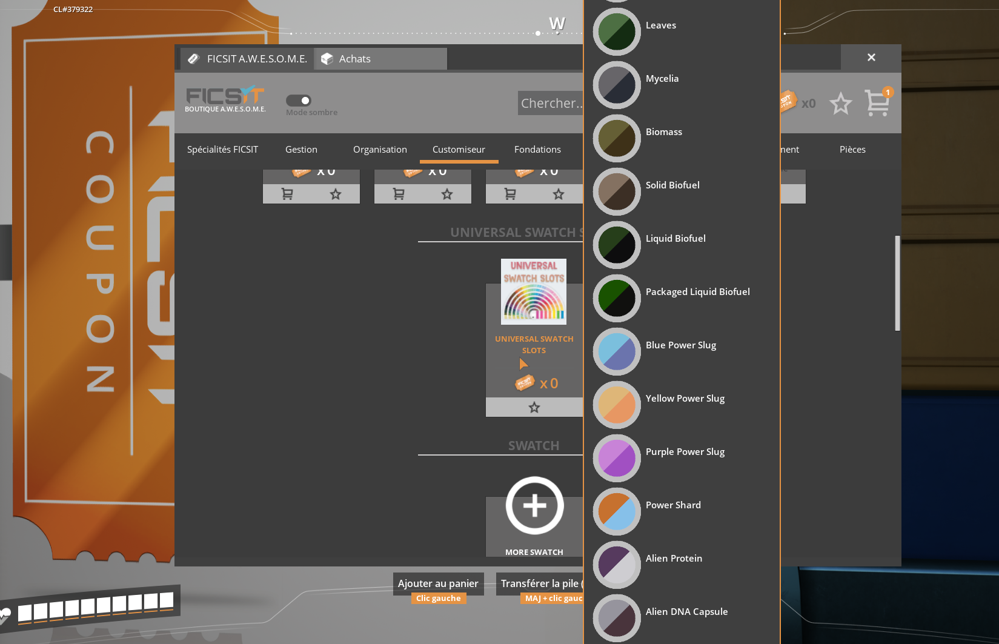

# Overview
Tired of re-doing your color preset between each game or being limited by the low number of swatch slots? Well, this mod is made for you!

This mod allows you to create your own palette of swatches and apply it to any session game you want. Meaning that you can share swatches between different session or even with other players by simply copying their JSON configuration!
This JSON configuration gives you a lot of options to customize your palette as you wish:
- You can create groups to oragnize your swatches as you want.
- You can name each of your swatch as you want (duplicates are allowed and will be treated as distinct slot).
- You can define priority between groups and swatches in order to make them appear the way you want.
- You can tell the mod to add the primary and / or the secondary colors of your swatches to the player color preset list.

Two default palettes come with this mod. Each contains the same dinstinct swatches for each craftable item in the game, only the language change (one in english, one in french).

# How to Use
In order to make the swatch slots appear in your game you need to configure the mod directly via the ingame menu or by editing the JSON file located at "YourStatifactoryGameFolder/FactoryGame/Configs/UniversalSwatchSlots.cfg"
- **Step 1:** The first array represent the palette / session associations. This is where you tell the mod which palette to apply to which session game (be sure to use the session name and not the save game name). You can also configure the "add color swatches to player preset" behavior. 
- **Step 2:** The second array represent your available palettes. You can add / edit / delete as many as you want but keep in mind that the more you have the longer it takes to for the ingame menu to display. The fields are self explenatory and has tooltip to help you understand their purpose.
- **Step 3:** Launch a save game that belongs to session your entered.
- **Step 4:** Go to your nearest Awesome Shop, customization tab, and buy the Universal Swatch Slots upgrade for only 1 coupon !!!

Note: I recommand to directly edit the JSON configuration as the ingame menu can take a lot of time to display everything. Be sure to have launched the game at least one time with this mod in order to make the default configuration appears.

# Multiplayer

This mod has been tested on windows dedicated server but should also work with linux server. To make it work, simply edit the UniversalSwatchSlots.cfg server file to match the session name you want to apply the mod to. Normally, no joining player doesn't need to set up any configuration on their side but if you're experiencing issue (like swatch slots don't appear) make sure to have to have the same configuration file on both sides.

When playing in host / client mod make sure that all players share the same configuration file (or at least the same palette and palette association than the host has).

# Images

# Q/A

**Is this mod compatible with More Swatch Slots ?**

As far as I have tested yes and no. Your game will not crash but the swatch slots added by More Swatch Slots will share the same color as the first swatches of your palette. Meaning that when you change one it will also change the other. However the custom slots that you add with More Swatch Slots don't seem to be concerned, they will remain as they are.

**I have deleted some swatches in the default configuration and want them back, how do I do ?**

Well simply delete or move your configuration file to another location and launch the game again. You can then edit the JSON to put your own palette back.

**What happen if I have applied a swatch to a building and remove it from the palette ?**

If the swatch you removed was the last of your palette nothing.
If the swatch you removed was somewhere else in your palette, all swatches that were after it will be moved up by one in the list messing up everything. To revert it back, edit the JSON file to re-add a swatch where the one you removed was.

**What happen if I have applied swatches of a palette and want to switch to another ?**

If your new palette has less swatches than your previous one only the buildings that uses the first swatches (as many as your new palette has) will be changed, all other extra slot of your old palette will persist.
If your new palette has more or equal number of swatches than your previous one all the swatches will be modified. 

**What happen if I have applied swatches of this mod to my building and uninstall the mod ?**

They will turn black or back to their default color.
Caution: If you save your game and reinstall the mod your building colors will be not restored!
Note: If you have selected the "add color to player preset" these colors will remain in your game. You can delete them by clicking on the trash icon

# Support
For questions or support, contact:
- **Issue Tracker:** [GitHub Issues](https://github.com/Loupimo/UniversalSwatchSlots/issues)
